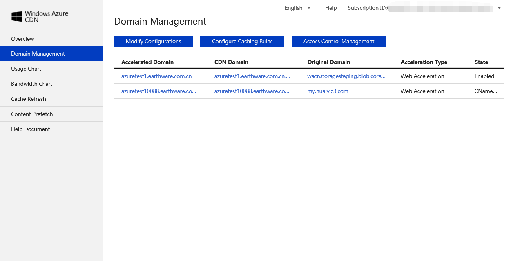
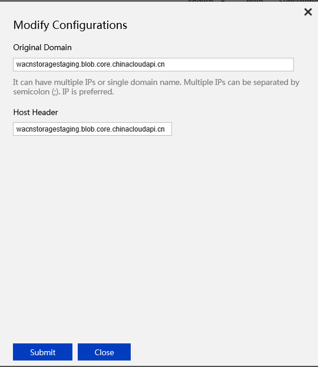
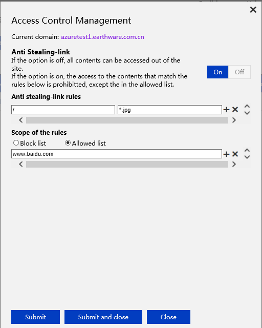
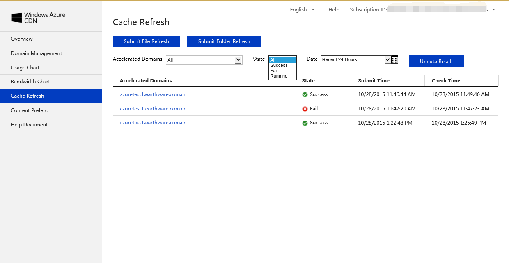
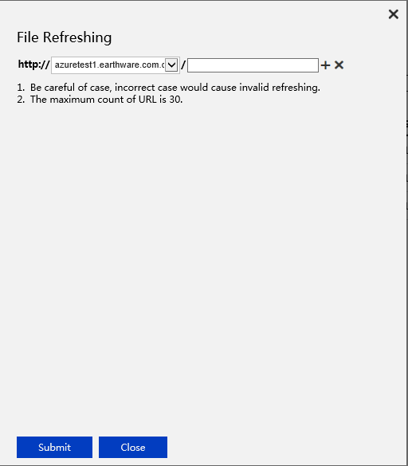
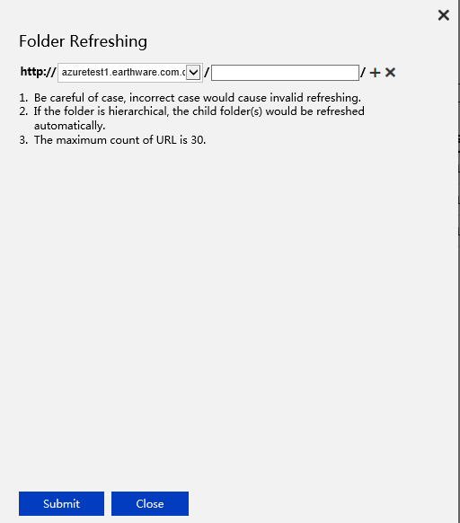
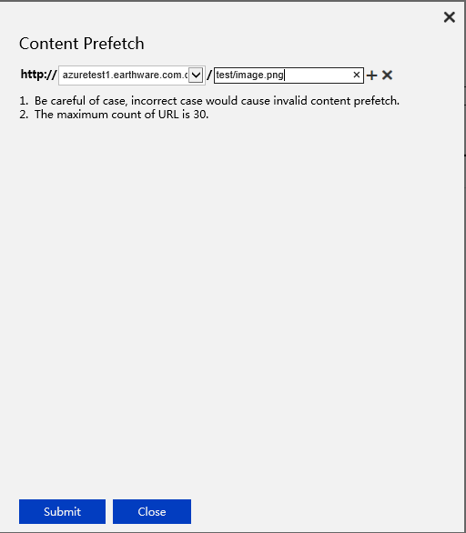

#Overview
In Advance management page, you will see overview of then endpoints you created under selected subscription ID. Parameters: Total Domain, Total Enabled Domain, Total Usage in Current Month and Bandwidths in Current Months.

#Domain Management
You can see all the domains list created under selected subscription ID.
You can Modify Configurations, Configure Caching Rules and Access Control Management.

**Modify Origin Domain**

Windows Azure CDN has default caching rules. You can also customize caching rules and customized rules will be applied first. If doesn’t hit customized rules, it will apply default caching rules.

**Modify caching rules**

- Folder caching rules: Folder must begin with ‘/’, e.g. "/pic", "/doc", "/htdoc/data", caching rules will apply to all sub folders.
- File caching rules: Use common suffix, e.g. "jpg", "png", "gif", "txt", "m4v", "mp3", caching rules will apply to all files with set suffix under specified folder.
- Caching order: Caching rules follow first-set, first apply. 

**Access Control Management**

Can configure Referer Block List and Allowed List to achieve anti-stealing link.
Each rule applies to both folder and files, e.g. all png files under /*.png.
Block list: when Referer is in block list, access is denied. Otherwise can do.
Allow list: only when Referer is in allow list, access is allowed. Otherwise, access denied.

#Usage Chart
Select Subscription ID, acceleration domains and date to view chargable usage.

#Bandwidth Usage
Select Subscription ID, acceleration domains and date to view bandwidth usage.

#Cache Refresh
Select Subscription ID, acceleration domains and date to view Cache states. Cache Refresh has 3 states: Success, Fail and Running. You can also configure cache refresh rules, File Refresh and Folder Refresh. 

**File refresh**

You can click 'Submit File Refresh' to set File Refreshing rule. Can click ‘+’ to add rules and ‘X’ to delete rules.

**Folder Refresh**

Submit Folder Refresh to set folder refresh rules. Can click ‘+’ to add rules and ‘X’ to delete rules.

**Content Prefetch**

You can select Subscription ID, Acceleration Domains and Date to view content prefetch per your request. It has 3 states: Success, Fail and Running.

Can click Submit Prefetch to set rules to prefetch contents, this applies to large file distribution and reduces response time when user access contents the first time.

