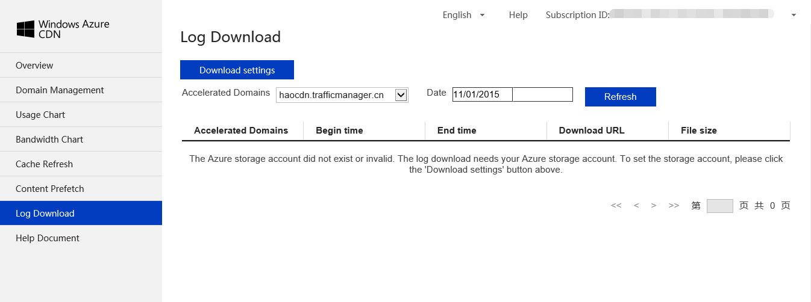

#Log Download
Click on Log Download on left navigation panel to download logs about selected domains.
##Log Download View
To be able to download CDN logs,you need an Azure Storage Account to store them. Please click on "Download settings" to add your storage account.

##Download Settings View
In this view, you can add your Azure storage account and select domains that you want to download logs. After validation, all log files will be stored under above storage account. You can remove the storage account to disable log download. 

##Log Format
Logs are stored as blob under blob container "cdn-access-logs" and each blob is Gzipped as CSV file. See details below:

 - c-ip: client IP address
 - timestamp: access time
 - cs-method: HTTP requested actions, e.g.GET method.
 - cs-uri-stem: the Universal Resource Identifier, or target, of the action.
 - http-ver: HTTP protocol version
 - sc-status: Protocol Status, the HTTP or FTP status code.
 - sc-bytes: the number of bytes that the server sent. 
 - c-referer: client referer
 - c-user-agent: client user agent
 - rs-durations(ms): request time (ms)
 - hit-miss: CDN cache hit/miss ID
 - s-ip: Server IP Address, the IP address of the server on which the log file entry was generated.

**Note** If logs do not have values for above listed items, they will be set to "-", e.g. "c-referer". Also, depending on edge point settings, "rs-duration","hit-miss","s-ip"　may also be null.

**Note** After CDN acceleration, all visit records are from CDN edge points. If you want to know customer IP address, please refer to below.

When CDN goes to origin domain, it will add origin IP address to **X-FOrwarded For** in HTTP Header, and Web server of origin domain will add this to log.

Take Nginx as an example, can add below information into log configurations:

